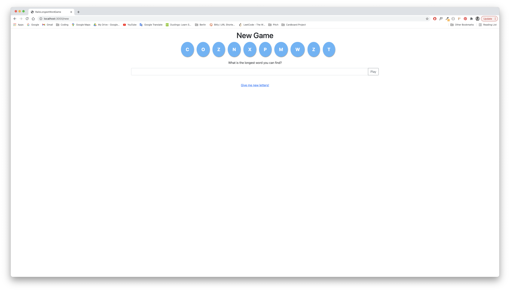
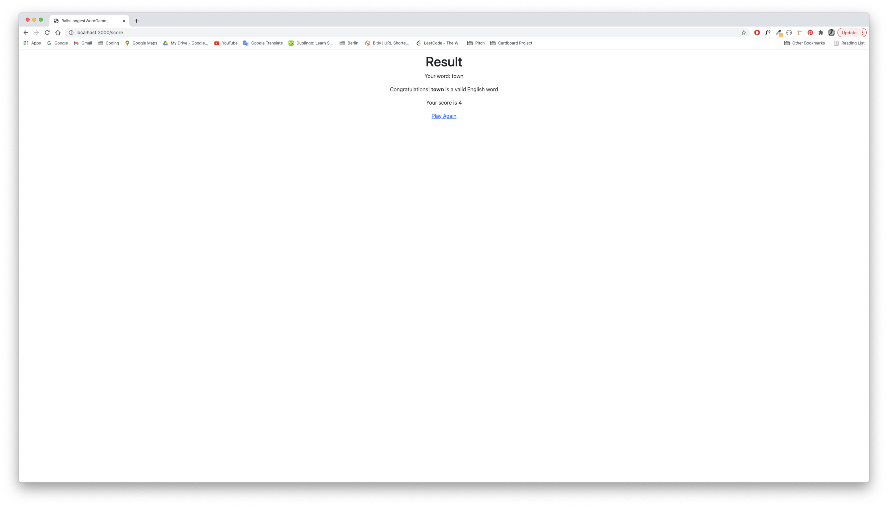

# Longest Word Game

This is one of my earliest Ruby on Rails projects. It is a very simple word game where the user is presented a random set of 10 letters and instructed to create the longest word possible. Their score is based on if it a valid English word and it's length.


## Game Play





## Install

### Clone the repository

```shell
git clone git@github.com:jordannadroj/rails-longest-word-game.git
cd project
```

### Check your Ruby version

```shell
ruby -v
```

The ouput should start with something like `ruby 2.5.1`

If not, install the right ruby version using [rbenv](https://github.com/rbenv/rbenv) (it could take a while):

```shell
rbenv install 2.5.1
```

### Install dependencies

Using [Bundler](https://github.com/bundler/bundler) and [Yarn](https://github.com/yarnpkg/yarn):

```shell
bundle && yarn
```

## Serve

```shell
rails s
```


